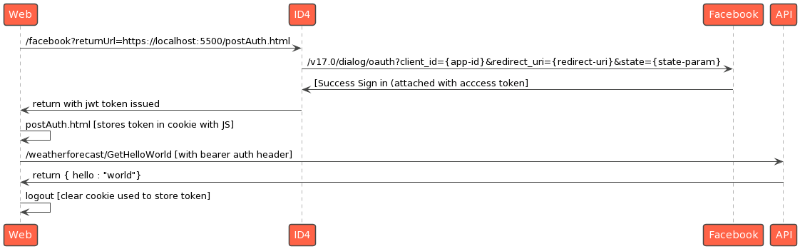

# id4poc

## FLOW:
   
# Web
Hosted using live-server on port 5500

## ID4
PORT:5001  

Routes:  
- facebok?returnUrl="one of the valid return urls that was stored in appsettings"
 
## API
PORT: 7171  
Routes :   
- api/weatherforecast/get
- api/weatherforecast/GetHelloWorld